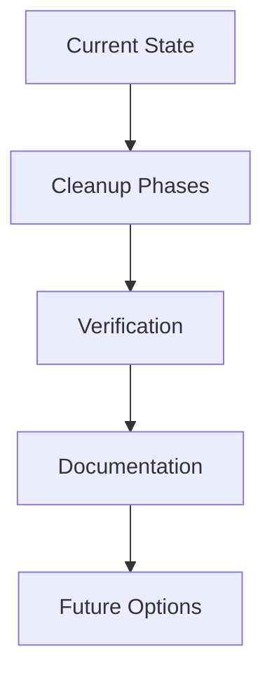
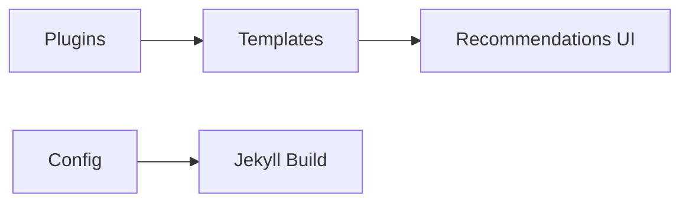

# Embeddings System Cleanup Plan (Enhanced)

**Date:** June 13, 2025  
**Status:** Draft  
**Goal:** Move all embedding-related files to organized archive structure with enhanced safety and documentation

## Strategic Enhancements


### Safety Mechanisms
- Create dedicated git branch (`git checkout -b embeddings-cleanup`)
- Implement dry-run validation for configuration changes
- Capture pre/post cleanup snapshots

### Dependency Mapping


### Automated Verification
- Test script for "You might also enjoy" component
- Build success/failure metrics tracking
- Post-cleanup link checker

### Knowledge Preservation
- Architecture Decision Record (ADR) template
- Performance metrics comparison
- Lessons learned documentation

## Problem Analysis

The embeddings recommendation system was an ambitious attempt to create Steph Ango-style semantic recommendations but was never completed. Currently causing:
- Jekyll build warnings about "No Co-Pilot embeddings file found"
- Complex parsing errors from unfinished Co-Pilot integration
- Performance issues from large file processing attempts
- Code maintenance burden from experimental features

## Files to Archive

### 1. Ruby Plugins (Active Code - Causing Issues)
- `_plugins/embeddings_recommendations.rb` (159 lines) - Main broken engine
- `_plugins/tag_based_recommendations.rb` (99 lines) - Working fallback system  
- `_plugins/copilot_parser.rb` (158 lines) - Experimental Co-Pilot parser

### 2. Development Tools
- `debug_copilot.rb` (207 lines) - Debug script
- `analyze_copilot_structure.py` (164 lines) - Python analysis tool

### 3. Documentation 
- `docs/EMBEDDINGS_RECOMMENDATIONS_PLAN.md` (293 lines) - Implementation plan

### 4. Configuration Cleanup
- `_config.yml` (lines 30-34) - Remove embeddings config section

### 5. UI Components (Keep - Working)
- `_layouts/note.html` (lines 17-28) - "You might also enjoy" template
- `_sass/_style.scss` (lines 607-645) - Recommendations styling

## Archive Organization

Create: `docs/archived-projects/embeddings-system/`

```
docs/archived-projects/embeddings-system/
├── README.md (overview + metadata.json)
├── plugins/
│   ├── embeddings_recommendations.rb
│   ├── tag_based_recommendations.rb
│   └── copilot_parser.rb
├── development-tools/
│   ├── debug_copilot.rb
│   └── analyze_copilot_structure.py
├── documentation/
│   └── EMBEDDINGS_RECOMMENDATIONS_PLAN.md
├── configuration/
│   └── config-snippet.yml (saved config section)
└── dependency-graph.md
```

## Cleanup Actions (Enhanced)

### Phase 0: Pre-Cleanup
1. Create restoration branch: `git checkout -b embeddings-cleanup`
2. Capture build performance baseline: `time bundle exec jekyll build`
3. Take site snapshot (using puppeteer MCP tool)

### Phase 1: Archive Files
1. Create archive directory structure
2. Move Ruby plugins to archive (removes Jekyll build errors)
3. Move development tools to archive
4. Move documentation to archive
5. Save config section using pattern matching

### Phase 2: Configuration Cleanup  
1. Remove embeddings config from `_config.yml` using regex pattern
2. Test Jekyll build (should eliminate warnings)
3. Verify site functionality without embeddings system

### Phase 3: Verification
1. Automated build test: `bundle exec jekyll build --trace`
2. Link checker execution
3. Smoke test of recommendations UI

### Phase 4: Documentation
1. Generate dependency graph
2. Create ADR for cleanup decision
3. Record performance metrics

## Risk Mitigation
| Risk | Probability | Impact | Mitigation |
|------|-------------|--------|------------|
| Template dependencies | Medium | High | Pre-cleanup analysis |
| Config over-removal | Low | Critical | Pattern-based removal |
| Performance regression | Low | Medium | Baseline metrics |
| Lost functionality | Medium | High | Manual smoke testing |

## Expected Benefits

### Immediate
- ✅ Eliminate Jekyll build warnings/errors
- ✅ Faster build times (no complex file parsing)
- ✅ Cleaner codebase (remove experimental code)
- ✅ Reduced maintenance burden

### Preserved
- ✅ Complete archive of all work done
- ✅ Documentation for future reference  
- ✅ UI components ready for simpler implementation
- ✅ Working tag-based system could be restored easily

## Future Approach (If Desired)

Instead of complex Co-Pilot parsing:
1. **Simple tag-based recommendations** (already working)
2. **Manual curation** (Steph Ango often does this)
3. **Lightweight similarity** (title/content keyword matching)
4. **External service** (if semantic similarity truly needed)

## Rollback Plan

If needed, restoration process:
1. Checkout original branch: `git checkout main`
2. Restore plugins from archive
3. Insert config snippet to `_config.yml`
4. Verify full restoration

## Next Steps

1. Execute Phase 0: Pre-Cleanup
2. Implement archive creation
3. Perform systematic file moves
4. Clean configuration
5. Run verification tests
6. Complete documentation

---

**Risk Level:** Low (archiving, not deleting)  
**Complexity:** Enhanced with safety mechanisms  
**Time Estimate:** 25-35 minutes  
**Reversible:** Yes (complete archive + git branch)