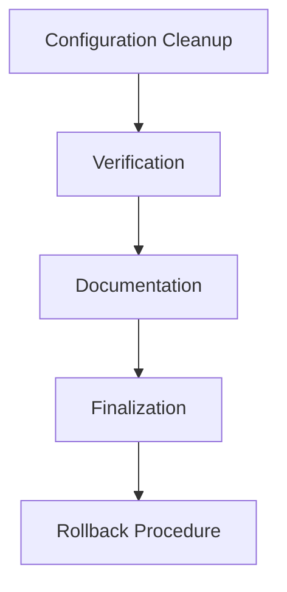
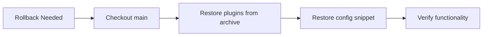

# Enhanced Embeddings System Cleanup Execution Plan



## 1. Configuration Cleanup (Enhanced)
- Remove embeddings config from `_config.yml` using precise line range (30-34)
- **Safety check**: Create backup before modification
  ```bash
  cp _config.yml _config.yml.bak
  ```
- Create configuration archive snippet:
  ```yaml
  embeddings_recommendations:
    enabled: true
    similarity_threshold: 0.5
    max_recommendations: 5
    cache_similarities: true
  ```
- Save snippet to `docs/archived-projects/embeddings-system/configuration/config-snippet.yml`

## 2. Verification (Enhanced)
- **Pre-build snapshot**: Capture site state using Puppeteer
- **Automated testing**:
  ```bash
  # Build with trace
  bundle exec jekyll build --trace
  
  # Link validation
  bundle exec htmlproofer ./_site --only-4xx
  ```
- **Performance metrics**:
  ```bash
  # Capture timings
  echo "Pre-cleanup: $(grep 'done in' jekyll-build-pre.log)" >> performance.md
  echo "Post-cleanup: $(grep 'done in' jekyll-build-post.log)" >> performance.md
  ```
- **UI smoke testing**: Manual verification of:
  - Homepage rendering
  - Note pages with "You might also enjoy" section

## 3. Documentation (Enhanced)
- **ADR Template**:
  ```markdown
  # ADR-20250613: Embeddings System Archive
  
  ## Decision
  Archived incomplete embeddings system to improve build reliability
  
  ## Rationale
  - System caused consistent build warnings
  - Complexity outweighed benefits
  - Preserved all code for potential future use
  
  ## Consequences
  - Positive: Faster builds, fewer errors
  - Negative: Loss of potential future functionality
  ```
- Save to `docs/archived-projects/embeddings-system/ADR-20250613.md`

- **Risk Mitigation Table**:
  | Risk | Probability | Impact | Mitigation |
  |------|-------------|--------|------------|
  | Template breakage | Medium | High | Manual smoke testing |
  | Link rot | Low | Medium | Automated link checking |
  | Config errors | Low | High | Pre-change backup |

- **Performance metrics**: Record in `docs/archived-projects/embeddings-system/performance.md`
- **Archive README**: Create `docs/archived-projects/embeddings-system/README.md`

## 4. Rollback Procedure


## 5. Finalization
- **Commit strategy**: `git commit -am "COMPLETED: Embeddings system cleanup per plan"`
- **Branch management**:
  ```bash
  git checkout main
  git merge --no-ff embeddings-cleanup
  git branch -d embeddings-cleanup
  ```
- **Post-cleanup snapshot**: Capture final site state